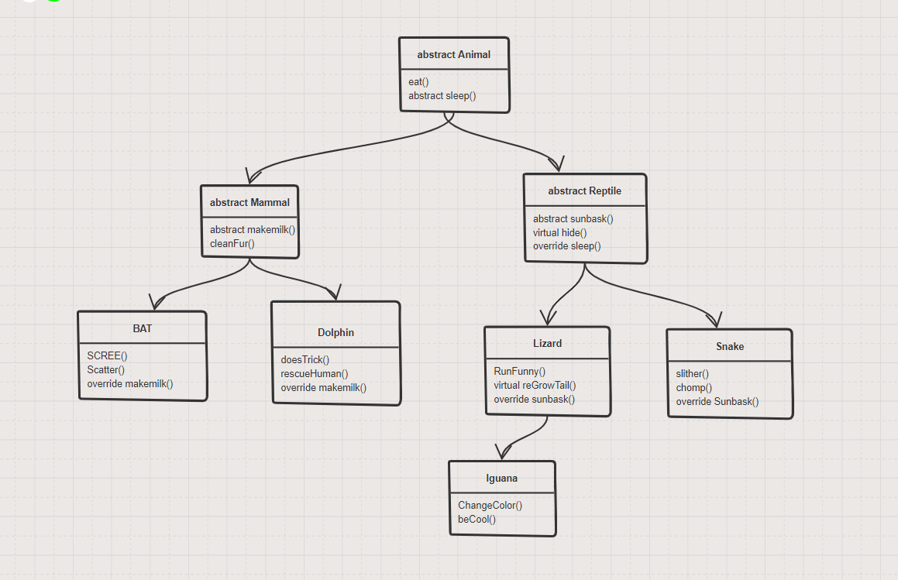

# Lab06

**Author**: Ameilia Valdes, Matthew Petersen
**Version**: 1.0.0 

## Overview
OOP principles. We created multiple classes to inherit methods+properties, then tested that the inheritence worked properly. 

## Getting Started
Clone the repository down to your local machine with: Git clone clonedRepoHere
Enter VSC and view all of our beautiful tests!
(tomorrow I presume we will be making this work in the console)

## Example

## Architecture
C# + VSC with some inheritance!

## OOP Principles
Inheritance - A class that is extending/implementing another class, has access to its parents properties. Meaning if we have the class Mammal : Animal, the Mammal class has access to the methods and properties within the Animal class.

Interface - Operates almost exactly like inheritance, except, we can utilize multiple interfaces. The inheritance acts as a base. We utilized our interface to check if we can ride dolphins or if bats can fly.

Polymorphism - This is used to modify/alter methods/properties within the childrens classes. We utilized polymorphism to alter the Sleep() method with our bats. Meaning the initial method of Sleep() should only display a string of "Zzz", but for our Bat class the return is "We don't sleep at night, we sleep during the day".

Abstraction - This is used like a hard blueprint. The children MUST implement any abstract things. We utilized this with our Sleep() function as well as other classes and methods. This meant that the children HAD to utilize the sleep method. Whether it returned a void or a string.

## Change Log
01/18/2021 - initial upload of the lab! Stay tuned for more.

1/19/2021 - New repository created, prior repo had incorrect file structure which broke after cloning. Unsure why this break happened, but it seems to be resolved.
